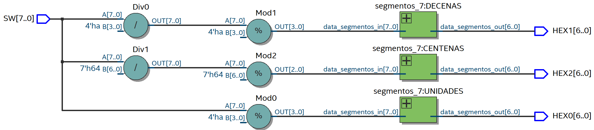
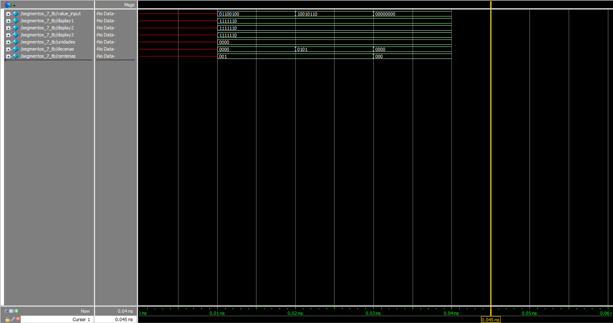
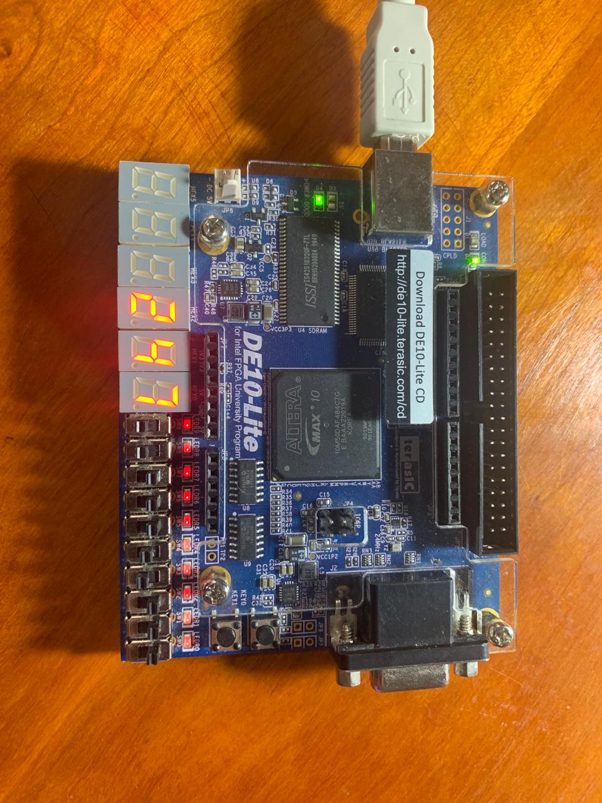

# 7 segment display

This lab presents a simple way to map the switches of the FPGA board to the 7 segment displays it has. The code takes a numerical input from the switches and interprets it as a decimal number, later to be encoded for 7 segment displays.

# Schematic
The RTL schematic shows 

# Test-bench
In the testbench we can see how the value of the units, tens and hundreds changes as the input value changes, which is what is expected. We can also see the output that is going as the encoding for the 7 segment displays.

# Implementation

# Lessons from the lab
The lessons from this lab are simple, but a few. First, one can learn how to create a simple wrapper for a module, which is imperative for learning to create modular designs. Secondly, one learns to interact with the 7 segment displays that the board provides. Lastly, the lab acts as a short practice of doing simple arithmetic operations in Verilog.