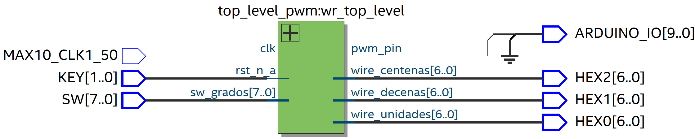
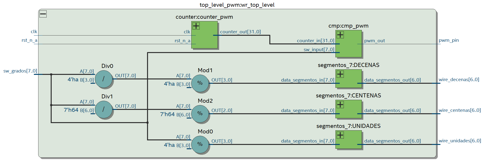
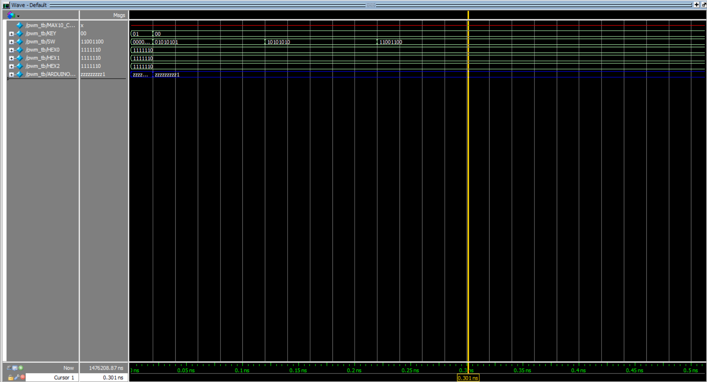
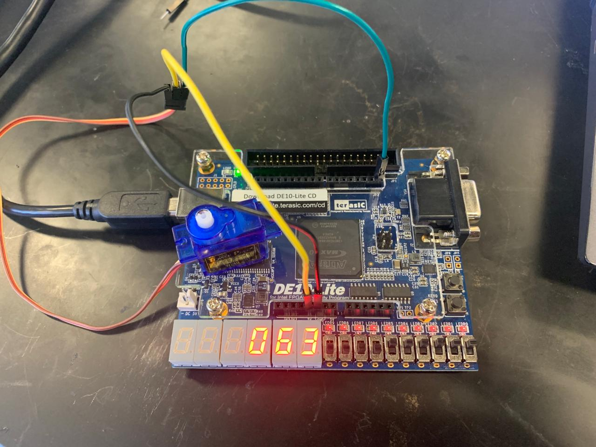

# PWM

This lab focuses on implementing Pulse Width Modulation (PWM) using an FPGA. Students learn to generate PWM signals and control their duty cycles based on switch inputs. By interacting with switches, they gain hands-on experience in real-time PWM control, making it an essential exercise for understanding PWM concepts in FPGA development.

# Schematic

# Test-bench

# Implementation

# Lessons from the lab
1. **PWM Generation**: Learn to generate PWM signals using a dedicated module (`cmp_pwm`), controlling the duty cycle based on a counter value and switch input (`sw_grados`).

2. **Counter Implementation**: Implement a counter module (`counter_pwm`) to generate a count value based on the master clock (`clk`), influencing the PWM signal's duty cycle.

3. **Switch Interaction**: Interact with switches (`sw_grados`) to adjust the PWM output, providing hands-on experience in real-time control of FPGA-based systems.

4. **Data Processing and Display**: Process switch input to display human-readable formats (`unidades`, `decenas`, `centenas`) on 7-segment displays (`wire_unidades`, `wire_decenas`, `wire_centenas`), enhancing understanding of data manipulation and visualization techniques.