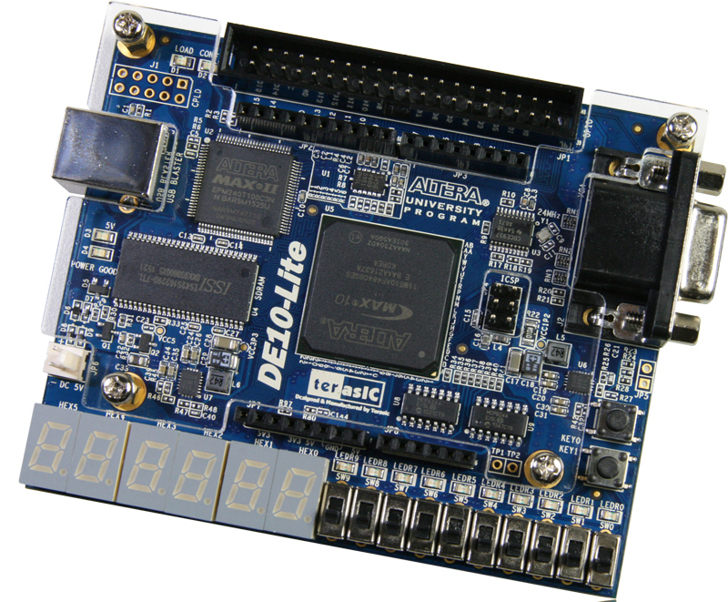

# Verilog labs

This repository contains the results of labs from course on programable logic and Verilog.

# What is Verilog?
**Programmable logic** involves configuring digital devices to perform specific logic functions.

**FPGAs (Field-Programmable Gate Arrays)** are reconfigurable chips used for custom digital circuit design.

**Verilog** is a hardware description language (HDL) for designing digital systems.

# Structure of the repo
Each project has a `.md` file within, which helps explain the project itself by presenting:
- A brief description of the lab
- Code and simple schematics
- Test-bench images and results
- Picture of the loaded implementation
- Brief reflection on what can be learn from performing that lab

**Note:** All labs were developed for the DE10-Lite Intel Altera FPGA platform. Quartus Lite 18.0 was used for developing and flashing the boards. Modelsim was used for the presented test-benches.

