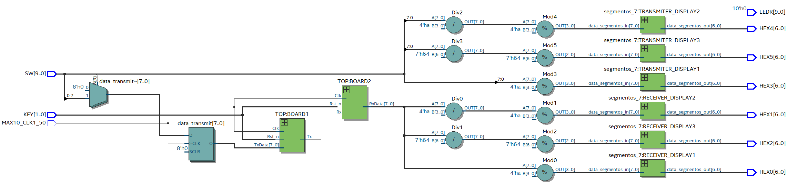
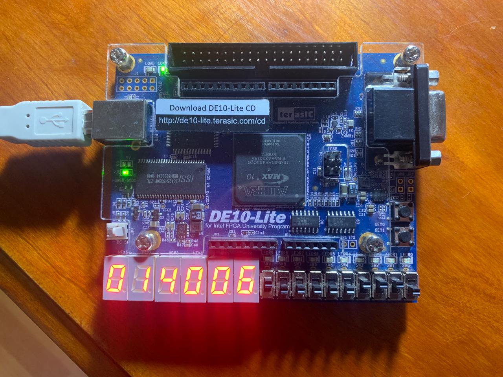

# UART

This lab presents the UART (Universal Asynchronous Receiver-Transmitter) activity; implementing UART communication between two FPGA boards (BOARD1 and BOARD2). Each board acts either as a transmitter or a receiver. Switch inputs on BOARD1 are transmitted to BOARD2, where they are displayed on 7-segment displays. Similarly, data received by BOARD2 is displayed on its 7-segment displays and can be sent back to BOARD1 if needed.

# Schematic

# Implementation

# Lessons from the lab
1. **UART Communication**: Understanding the principles of UART communication and its implementation in FPGA-based systems. They gain insights into the asynchronous serial communication protocol, including data transmission and reception.

2. **Interfacing FPGA Modules**: Integrating UART modules with other FPGA components such as switches, 7-segment displays, and clock signals. This reinforces their understanding of module interfacing and communication in FPGA designs.

3. **Data Conversion**: Converting data between different formats for transmission and display, such as converting switch input values to 7-segment display format and vice versa. This enhances their skills in data manipulation and visualization in FPGA projects.

4. **Synchronous Design**: Designing synchronous systems where actions are synchronized with clock signals. This reinforces concepts of synchronous digital design and ensures reliable operation of the UART communication system.
