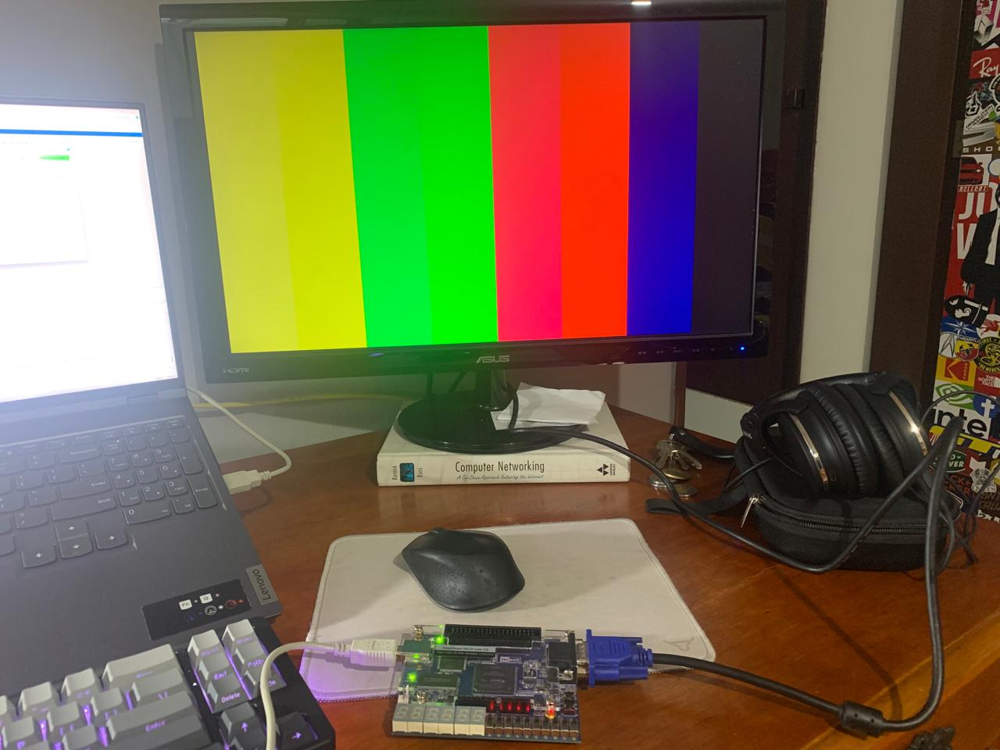

# VGA

This lab implements VGA video as an FPGA module, providing hands-on experience with generating VGA-compatible signals. By integrating a VGA controller module, students learn about horizontal and vertical synchronization and color data generation. This foundational exercise prepares them for developing FPGA-based display systems and emphasizes the importance of modular design principles in FPGA development. 

# Schematic

# Implementation

# Lessons from the lab
1. **VGA Output Generation**: Learn to generate VGA output signals for display, including horizontal and vertical sync signals and color data.

2. **Clock Generation**: Understand how to generate stable clock signals necessary for VGA timing using a clock divider module.

3. **Peripheral Interaction**: Interact with external peripherals like buttons to control VGA operation, enhancing understanding of FPGA interfacing with external devices.
