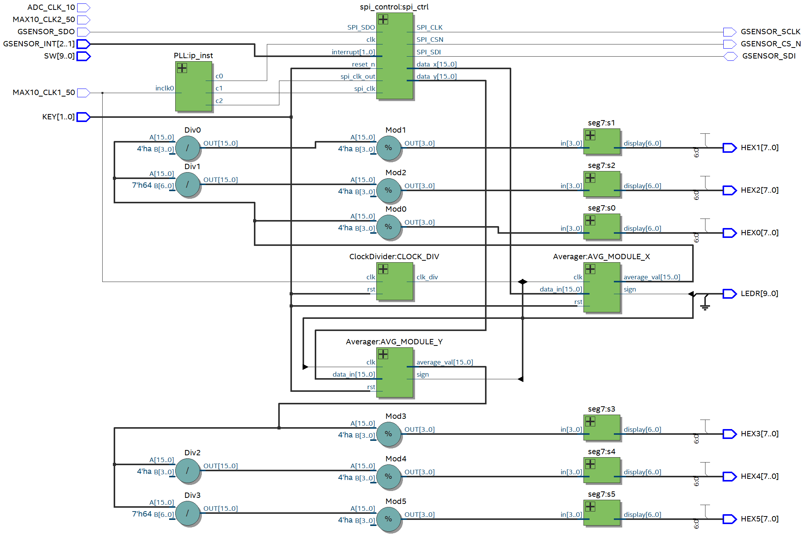
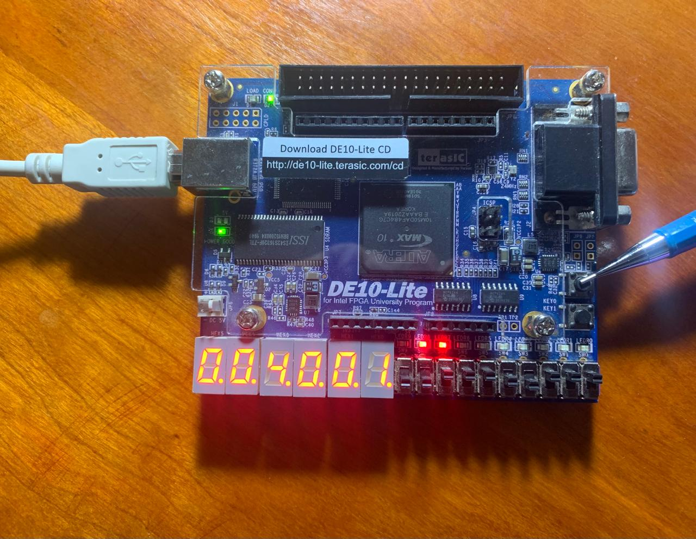

# Accelerometer

This lab presents a system that uses the integrated accelerometer from the FPGA board in order to display readings of the experienced acceleration on the board. The red LED with indexes 8 and 7 are used as a way to show when the numbers have negative sign (for the different axis that the accelerometer module supports).

# Schematic

# Implementation

# Lessons from the lab
1. **Modular Design**: Learn to create a wrapper for modules, crucial for modular designs in FPGA development.

2. **Peripheral Interaction**: Gain practical experience in interfacing with 7-segment displays and other peripherals provided by the FPGA board.

3. **Verilog Arithmetic**: Practice performing arithmetic operations in Verilog for data manipulation and display.

4. **Bit Shift Operations**: Understand and apply bit shift operations for efficient data handling and manipulation, particularly relevant for processing sensor data.

5. **Clock Management**: Understand clock synchronization and division techniques for coordinating timing signals within the system.

6. **Data Processing**: Explore data processing techniques like averaging for filtering and smoothing accelerometer data.
