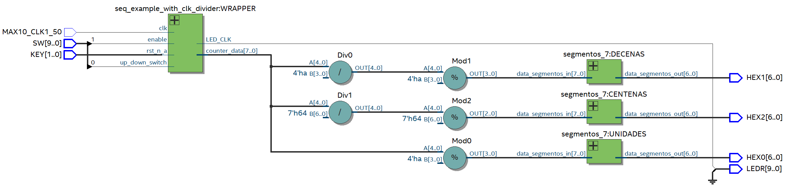
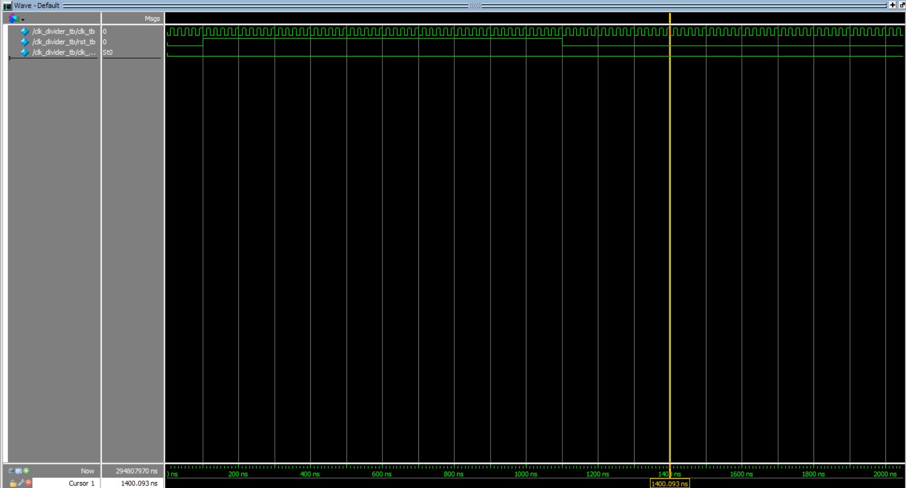

# Clock divider

This lab presents a basic implementation of a clock divider. The clock divider works by using a counter that limits an output signal. By controlling how high the counter goes, we can convert an input of a clock _clk_ into an output of _clk/counter_ signal. This module is essential, as it constitutes one of the most important building blocks for more complex and time-sensitive labs.

# Schematic

# Test-bench

# Implementation

# Lessons from the lab
1. **Clock Divider Implementation**: Learners practice implementing a clock divider, essential for controlling timing signals in FPGA designs.

2. **Sequential Logic Design**: The lab introduces sequential logic design concepts through conditional clock division based on input switches and reset conditions.

3. **Peripheral Interaction**: Students interface with switches and LEDs, gaining practical experience in controlling and monitoring external devices.

4. **7-Segment Display Integration**: Integration of 7-segment displays offers hands-on experience in visualizing processed data, reinforcing FPGA-based display techniques.

5. **Data Processing and Display**: The lab involves converting raw counter data into human-readable formats for display, enhancing understanding of data manipulation in FPGA systems.
