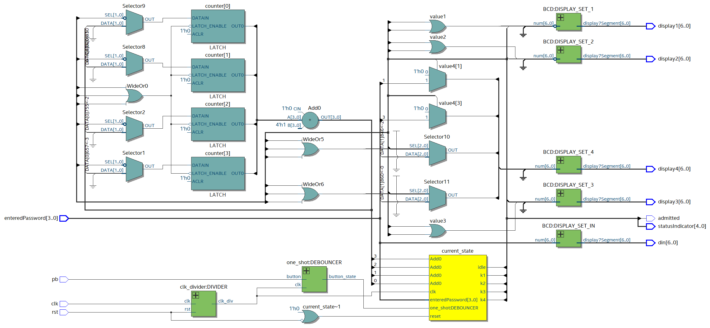
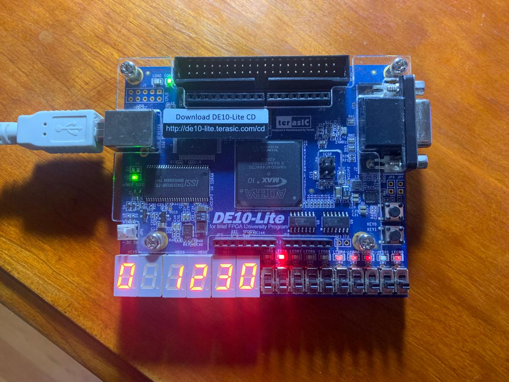

# Password

This lab presents a hands-on implementation of a password entry system using an FPGA module. Students design a finite state machine (FSM) to manage password entry stages and compare the entered password with predefined values for access verification. The lab also includes debouncing mechanisms for reliable button inputs and utilizes status indicators and 7-segment displays to provide feedback on the password entry process.

# Schematic

# Test-bench

# Implementation

# Lessons from the lab
1. **Finite State Machine (FSM)**: Implementing a FSM to manage password entry states efficiently.

2. **Debouncing**: Integrating debouncing mechanisms for stable button inputs, crucial for reliable system operation.

3. **Password Verification**: Comparing entered passwords with predefined values, showcasing conditional logic in FPGA design.

4. **Status Indication**: Utilizing status indicators to provide feedback on the password entry process, enhancing user interaction.

5. **Display Interface**: Interfacing with 7-segment displays for visualizing the password entry process, reinforcing display module usage.
